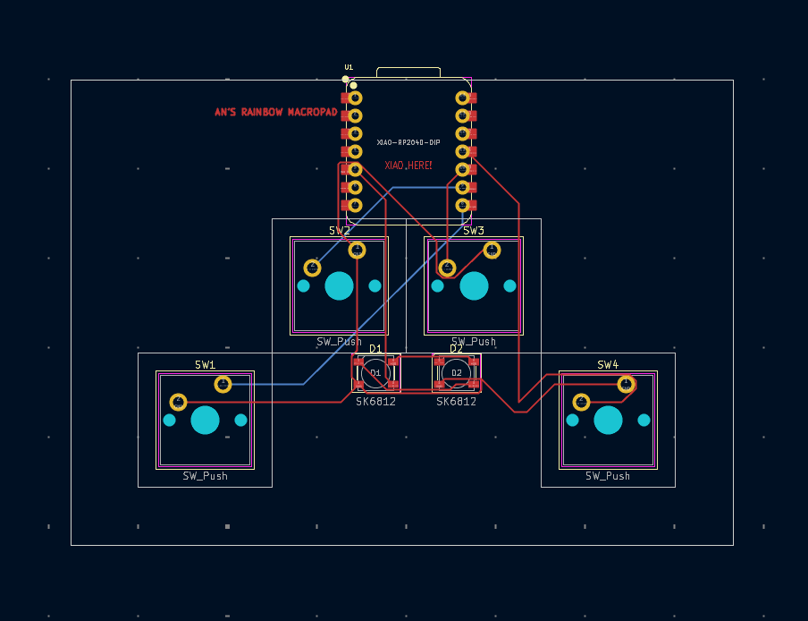
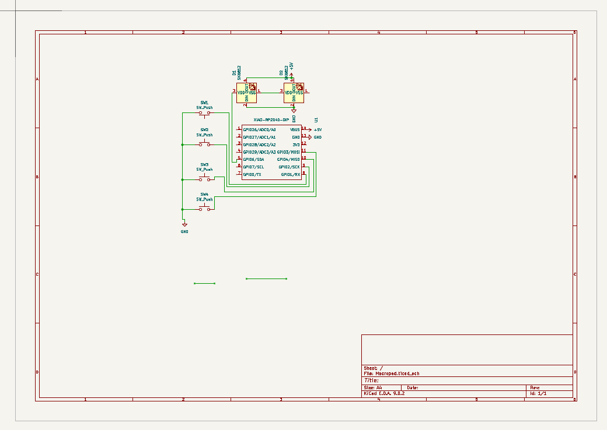

# AN'S RAINBOW MACROPAD 🌈

Welcome to my custom PCB project! This is a **4-key rainbow macropad** powered by a Seeed Studio XIAO microcontroller and featuring RGB lighting using SK6812 LEDs. It’s designed for simplicity and style, with a compact layout ideal for macros, shortcuts, or even game controls.

---

## 📝 Description

This macropad features:
- 4 mechanical push buttons for user input  
- 2 SK6812 addressable RGB LEDs for lighting effects  
- A Seeed Studio XIAO microcontroller as the brain of the device  
- Custom PCB layout designed in KiCad  
- Hand-solderable design with through-hole switches and components  

This is perfect as a beginner-friendly PCB project that involves basic routing, digital inputs, and RGB control!

---

## 📦 Bill of Materials (BoM)

| Quantity | Part                      | Description                            |
|----------|---------------------------|----------------------------------------|
| 1        | Seeed Studio XIAO         | Microcontroller (XIAO RP2040-DIP used) |
| 4        | SW_Push                   | Mechanical push button switches        |
| 2        | SK6812 Mini               | Addressable RGB LEDs                   |
| 2        | 0.1µF Capacitor           | Bypass capacitor for SK6812 LEDs       |
| 1        | PCB                       | Custom-designed PCB                    |
| 14       | Female header pins        | For XIAO socket (2×7 rows)             |
| -        | PCB traces                | Routed traces to connect components    |

---

## 🖼️ Screenshots

### 🧩 PCB Layout  

### 🧩 Schematic Layout 

---

## 🔗 Slack Username

**Slack:** `@anpham09`  
